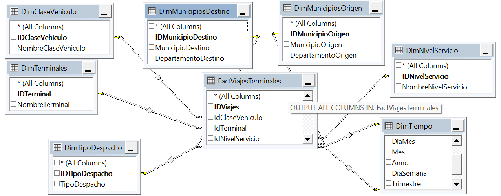
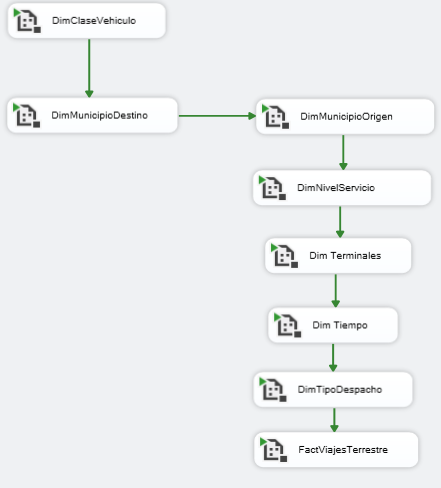

# Operation National Dispatch of Vehicles National

This project focuses on analyzing the intercity trips made by transport fleets to and from the various transportation terminals in Colombian cities, using data provided by Open Data Colombia. The primary objectives are to perform a descriptive analysis that provides insights into the number of passengers per city, the cities that receive the most passengers, the most frequently used routes, and the seasons with the highest passenger flow and number of trips, from 2018 to 2024.			

The data integration process will be carried out using ETL (Extract, Transform, Load) methodology, which involves:
Extraction: Collecting relevant data from Open Data Colombia.
Transformation: Cleaning, sorting, and organizing the data for analysis.
Loading: Importing the processed data into a suitable database or analysis tool for further study.

The project aims to offer valuable insights into transportation patterns and trends in Colombia, which can inform decision-making and improve transportation planning and services.

## Table of Contents
- [Requirements](#requirements)
- [Installation](#installation)
- [Usage](#usage)
- [Process](#process)
- [Visualization](#visualization)
- [Contributing](#contributing)
- [Contact](#contact)

 
## Requirements
- The National Vehicles Dispatch data source: [Datos Abiertos](https://www.datos.gov.co/)
- Divipola (National Geopolitical Colombian Division) dataset: [Datos Abiertos](https://www.datos.gov.co/)
- SQL Server: For creation of tables and quality check of the information
- Visual Studio 2019: For ETL creation

## Installation
1. Clone the repository.
2. Set up the SQL Server and Visual Studio 2019 as per the requirements.
3. Install Power BI Desktop from [Power BI](https://powerbi.microsoft.com/desktop/).

## Usage
1. Upload raw information from the official Colombian Data Repository. The dataset contains over 20,000,000 rows of information.
2. Use the ETL process to upload data to the Relational Database Management System (RDBMS).
3. Follow the steps in the `DWHMovilidadTables.sql` script to create the necessary tables and relationships.

## Process
The project is divided into three data manipulation stages:
1. **Upload Raw Information**: Using an ETL process.

2. **ER Model (Entity Design)**: Creating entities and relationships.
3. **ETL DWH upload information**: The data is transformed to fit the entity-relationship model, ensuring consistency and integrity.
4. **Kimball Model (Star Schema)**: Designing dimension and fact tables.
5. **ETL Kimball Model upload information**: The data is transformed into a star schema, organizing it into dimension and fact tables for efficient querying.

### Dataware House (ER Model)
Once the data is in the RDBMS, nine entities (tables) and their relationships are created in the Data Warehouse model. These tables are normalized to maintain data integrity.

    
### ETL Data Warehouse
The information is uploaded using an ETL process. Each entity has a pipeline, which is then joined into a principal package.
![!\[alt text\]](https://github.com/daram10/VehiclesDispatch/blob/main/DWHETLMovilidad.png)

### Kimball Model (Star Schema)
The Star Schema is designed to provide fast and easy access to data by denormalizing tables. This approach involves creating dimension tables and a fact table, which simplifies querying and improves performance.

In this project, seven dimension tables, including a time dimension, and one fact table have been created. These tables are structured to facilitate efficient data retrieval and analysis.

### ELT Kimball Model
The information is uploaded using an ELT process. Similar to the "ETL Data Warehouse" process, a pipeline was created for each dimension and fact table. These pipelines were then combined into the main package.

## Visualization
The project includes a Power BI file for visualizing the data. This visualization aims to provide insights into transportation patterns and trends in Colombia. [Dashboard](https://1drv.ms/u/s!AsDUqdq9SXRAh7hh-NOonI7mZXmSCw?e=L9jE0D)

## Contributing
Contributions are welcome! Please read the [CONTRIBUTING.md](CONTRIBUTING.md) for details on the code of conduct and the process for submitting pull requests.

## Contact
For any questions or suggestions, please contact:
- **Name**: Daram10
- **Email**: [your-email@example.com](mailto:your-email@example.com)
- **GitHub**: [daram10](https://github.com/daram10)